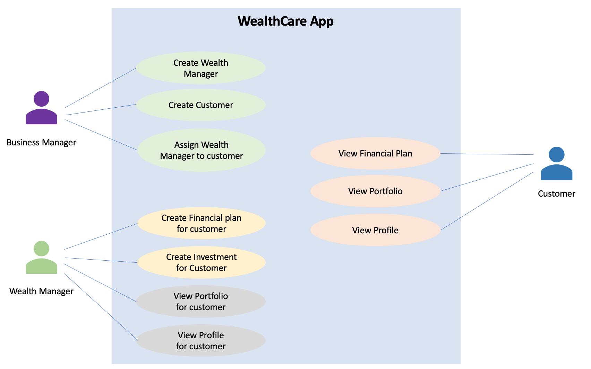
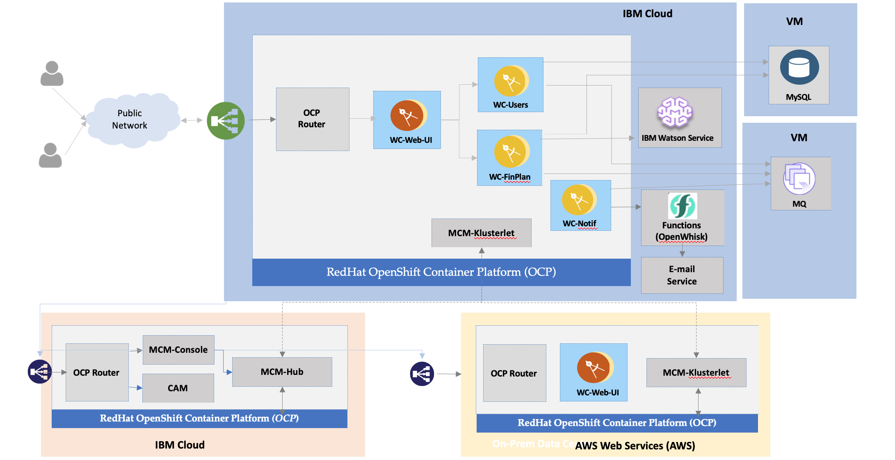

## Wealthcare Application

* Wealth Care is a wealth management company headquartered in Bangalore and rapidly expanded to all the major cities of India. It provides wealth management solutions to individuals in terms of financial plan creation and making investments. 
* It has been leveraging IT in a big way over the last decade and started their journey to cloud an year ago. They adopted lift and shift approach to move their apps to containers on Cloud initially. Recently they refactored their apps into micro-services and chosen Kubernetes open-standard as a container orchestration platform. 
* As the company is expanding their business rapidly, their demands from IT to match the business agility and speed are also increasing. The DevOps culture had to be adopted across the Organisation with small cross-functional teams working on micro-services development and deployment. The number of teams and the Kubernetes clusters have grown exponentially over a period of time and the management is losing control over the multiple environments spread across locations. 
* Also the IT leaders in the organisation have decided that they should not get locked into one Cloud environment. For their multiple needs across the Enterprise, they wanted to leverage multiple clouds in different locations. This has added a complexity in a different dimension altogether. All the streamlining of processes around Containerisation and DevOps seems to be falling apart with hybrid and multi-cloud demands in the Organization. 
* How would the IT team get visibility into the their apps and infrastructure in different Cloud environments? How could they automate the tasks of provisioning infrastructure, middleware and apps? How could they setup governance to ensure the security and compliance across all the environments? These are the challenges solved with Cloud Pak for Multi-Cloud Management from IBM. Letʼs see a demo around this scenario of Wealth Care company to understand more. 

## Personas

The application consists of the below 3 Personas.

#### Business Manager

Business Manager can do the following operations.

- Creates Wealth manager
- Creates Customer 
- Assign Wealth manager to the customer

#### Wealth Manager

Wealth Manager can do the following operations.

- Manage financial plan for Customer

	Create Goals

	Create Investment
- View Customer Portfolio
- View Customer profile

#### Customer

Customer can do the following operations.

- View Financial Plan
- View Portfolio
- View Profile

## Microservices

The application contains 4 micro services.

### Web-UI

Contains the UI part of the application
It calls other microservices to get details about Users and financial plans

### User

Provides login services
Provides services to create wealth managers, customers and assign wealth manager.
Sends message to the MQ when new wealth manager and customer are created.

### Financial plan

Provides services to create Goals and Investments.
Provides services to view the financial plan and Portfolio.
Sends message to MQ when new Goal is created.
Uses the Watson service to decide on the financial planning for the given investment on how to split the investment into stock, mutual fund and fixed deposit.

### Notification

Listen to MQ for new messages.
Upon arrival of new message, it sends the notification to the target users through IBM Functions OpenWhisk.

## Components and External services

The application contains the following components  and external services.

### MQ

User service put WealthManager and Customer created messages into the MQ
Financial plan service put Goal created messages into the MQ
Notification service reads the MQ messages and send notification to the Customers / Wealth manger

### Db2

Database is used by the User and Financial plan services to store the data

The Database related information available [here](configuration.md).

### Watson Service

Helps to decide on the financial planning for the Customer.
For the given investment amount, the Watson service split the given investment into Stocks, Mutual funds and Fixed Deposit based on the user profile and market trends. 

### IBM Functions (Openwhisk)

The notification service uses the IBM functions Open whisk to send email to notifications. 

## Deployment Topology

Here is the Deployment Topology of the application. 

## Deployment Steps

The Deployment steps are available [here](deployment/readme.md).

## Configuration

Configuration related to the Database, MQ and etc are available [here](configuration.md).

## License

The Wealthcare Application is licensed under Apache-2.0 License.

This application uses Angular. The licenses related to the components used by the angular is available in `wealthweb/angularUI/wealthcare-ui2/dist/wealthcare/3rdpartylicenses.txt`

## Tools and Technologies

- SpringBoot
- Angular
- H2 / DB2 / MySQL database
- IBM Cloud Pak for Application (Openshift)
- IBM Cloud Pak for MultiCloud Manager (Multi Cluster and Monitoring)
- IBM Cloud Pak for Integration (IBM MQ)
- IBM Watson Services
- IBM Functions - Openwhisk
